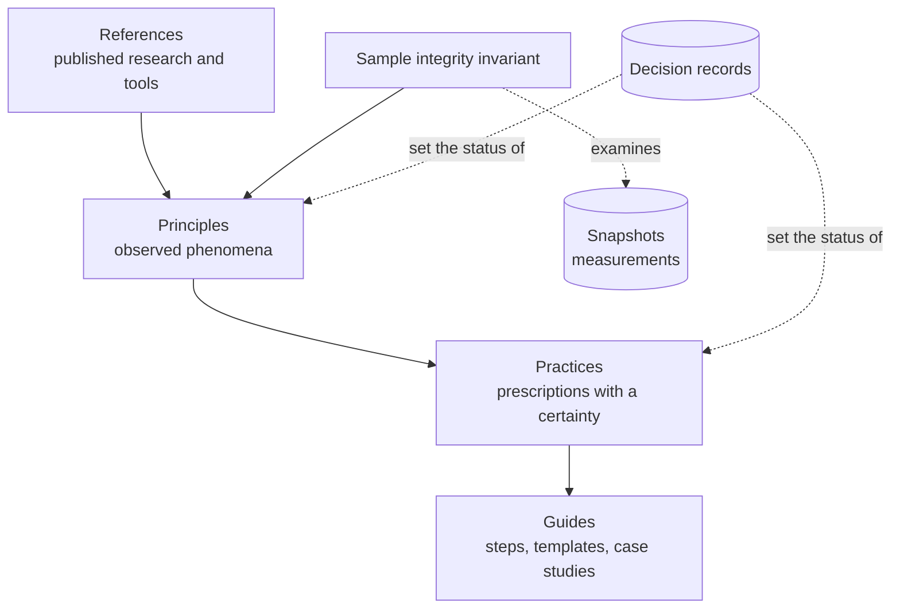
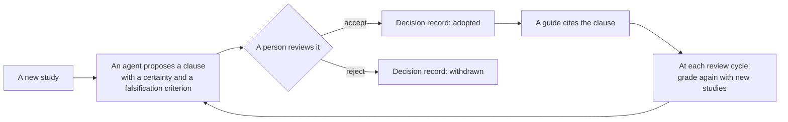

# Design

This document gives the design of the guidebook. The guidebook tells how to write repository documents that stay correct when the code changes. It uses published research and available tools, and it makes no new metric or tool ([decision 0001](decisions/0001-adopt-existing-methods.md)). Numbers in brackets refer to [REFERENCES.md](REFERENCES.md). [GLOSSARY.md](GLOSSARY.md) gives the terms.

## 1. Scope

- **Documents:** README, ARCHITECTURE, context files and CONTRIBUTING.
- **In scope:** growth by addition and outdated references in these documents, the rules and checks that prevent them, and reader tests of single documents (R-004).
- **Out of scope:** the general effect of context files on the task success of agents. [3] and [5] found no reliable gain in correctness, and [4] measured only time and tokens. This repository only cites them.

## 2. Layers and records

A higher layer changes less frequently than a lower layer. A lower layer obeys the rules of the higher layers.

| Layer | Location | Entry condition |
|---|---|---|
| Sample integrity invariant | §3 | It does not change |
| Principle | `principles/` | The certainty is moderate or higher. At least two different studies show the same direction |
| Practice | `practices/` | The clause has a certainty, a falsification criterion and a review date |
| Guide | `guides/` | The guide cites clause ids, reference numbers and sections of this document. It marks each step that has none of them. Each step ends with a completion criterion that a reader can verify [23]. A case study is not evidence |

Two studies are different if they have no author in common and use different methods. Then their errors are less likely to be the same. If their samples can overlap, write this in a refutation, and use it when you set the certainty.

Two records are not layers. You can only add to them. To change a record, write a new record that replaces it.

| Record | Location | Content |
|---|---|---|
| Decision record | `decisions/` | The reason for a change to the structure or to the status of a clause |
| Snapshot | `snapshots/` | Measurements |



## 3. Sample integrity invariant

> If a sample does not have sufficient quality or consistency, do not adopt conclusions from it.

This invariant applies to our own measurements and to cited studies. Use these available methods to examine a sample:

- **Sample quality:** the known problems of GitHub data [10] and the guidelines for samples in software engineering research [11].
- **Consistency and weak points:** the five GRADE domains [12]. These are risk of bias, inconsistency, imprecision, indirectness and publication bias. Lower the certainty for risk of bias if all evidence comes from synthetic experiments. Lower it for inconsistency if the results do not agree. Lower it for imprecision if the samples are small. Lower it for indirectness if the studies use other languages or agents.

## 4. Certainty

This repository adapts GRADE [12]. Each clause has a certainty and lists the domains that lowered it. Use this procedure, so that a second person gets the same result:

1. Select the start level. A principle states how often a phenomenon occurs, so its evidence starts at high. GRADE does the same for evidence about how often an event occurs [32]. A practice states the effect of a prescription. Its evidence starts at high for controlled experiments and at low for observational studies, surveys and essays.
2. Lower the level by one for each domain of §3 with a serious concern.
3. Do not raise the level. GRADE has reasons to raise it, but this repository does not use them.

| Certainty | Meaning |
|---|---|
| high | More research will probably not change the conclusion |
| moderate | More research can change the conclusion |
| low | More research will probably change the conclusion |
| very low | The conclusion is very uncertain |

## 5. Counter-evidence

Put counter-evidence into a clause as refutations, not as a list. A two-sided message without a refutation persuades less than a one-sided message. A two-sided message with a refutation persuades more [14]. A text that states a misconception and refutes it helps people learn [13].

1. Put each item of counter-evidence together with the judgment of this repository. Tell what the clause took from it and what limit stays.
2. Give each clause a falsification criterion. This follows the procedure of adversarial collaboration [15].
3. Before you propose a clause, read the limits of each cited study. Also look for studies that disagree with it.
4. Prefer recent studies, because agents and tools change quickly. Cite an older study only if no recent study examines the question. Then lower the certainty for indirectness if the old tools or agents are different.
5. Do not put counter-evidence in context files. Language models frequently miss negation [16]. Thus a context file contains positive instructions, each with a reason of one line. Refutations go in clauses and decision records. This rule applies reader studies [13] [14] to agents, so it is indirect.

## 6. Clause format

```yaml
id: R-001                  # P- for principles, R- for practices
layer: practice            # principle | practice
status: proposed           # proposed | adopted | superseded
certainty: low             # high | moderate | low | very-low
downgraded-for: [indirectness, imprecision]   # risk-of-bias | inconsistency | imprecision | indirectness | publication-bias
falsified-if: "A replication with the same conditions does not show the same effect"
review-by: 2027-03-24      # practices only
references: [1]
superseded-by: null
```

The body contains the clause, the reason (the evidence, for a principle) and the refutations. A practice also contains its application. An agent can make a clause with the status `proposed`. Only a person changes a status, and the person writes a decision record for it. To withdraw a clause, delete its file and write the reason in a decision record. Keep the file only if a different clause replaces it. Then set `status: superseded` and `superseded-by`.



## 7. Decision record format

Use the format of Nygard, and add one section, Alternatives considered [17]. The short Nygard format had the best results for comprehension [18]. Real decision records omit alternatives more frequently than other sections [19].

```
# N. Title
## Status
## Context
## Decision
## Alternatives considered
## Consequences
```

## 8. Tools and data

Use available tools for document checks. [guides/new-project.md](guides/new-project.md) §3 gives their order and their limits. For measurements of context files, use the Agent Context File Analysis dataset [6].

## 9. Clauses

Principles are in [principles/](principles/), and practices are in [practices/](practices/). Each clause has its own file. This document does not list them.

Withdrawn clauses:

- "AGENTS.md is a file for efficiency" (a prescription of design v1, 2026-09-24). Its source [4] examined one agent and did not measure correctness. Also, its conditions were different from [3]. This clause is older than the decision records, so its reason stays here.
- R-003 "Change rules when the agent makes an error" (2026-09-25): [decision 0003](decisions/0003-withdraw-r003-p003.md).
- P-003 "No evidence shows that repository overviews increase the task success of agents" (2026-09-25): [decision 0003](decisions/0003-withdraw-r003-p003.md).
- P-002 "Repository documents frequently contain outdated references" (2026-09-25): [decision 0006](decisions/0006-withdraw-p002-adapt-grade.md).

## 10. Pilot snapshot

`snapshots/2026-09-24-pilot/` contains measurements of metrics from design v1. This design does not use these metrics. Thus the guidebook does not cite the snapshot as evidence. The snapshot stays as an example: when we divided the sample, the conclusion changed direction. This example is the reason for §3.

## 11. Languages

Each language has one style guide. A file follows the style guide of its language, and it names only that style guide.

| Language | Files | Style guide | Mechanical check |
|---|---|---|---|
| English | All originals | ASD-STE100 Simplified Technical English [24] | No Hangul. Vale [29]: 25 words or fewer in each sentence, and 20 or fewer in `AGENTS.md`, `guides/new-project.md` and `guides/templates/`. A reviewer checks table cells and procedure sentences in other files |
| Korean | Translations with the name `<name>.ko.md` | fluent-korean [25] | No em dash |

A translation of `<name>.md` is `<name>.ko.md` in the same folder. If the two are different, the original is correct. The first line of a translation records the SHA-256 hash of its original. The check fails when the original changed after the recorded hash. It cannot show that the text of the translation follows the original. This is the method of [21]. To add a language, add a row to this table and write a decision record.

## 12. Open questions

| Question | Recommendation |
|---|---|
| Population | For context files, use the population of [6]. Keep repositories of agent products as a different population |
| Review cycle | Every six months. Set the certainty again when new papers or datasets are available |
