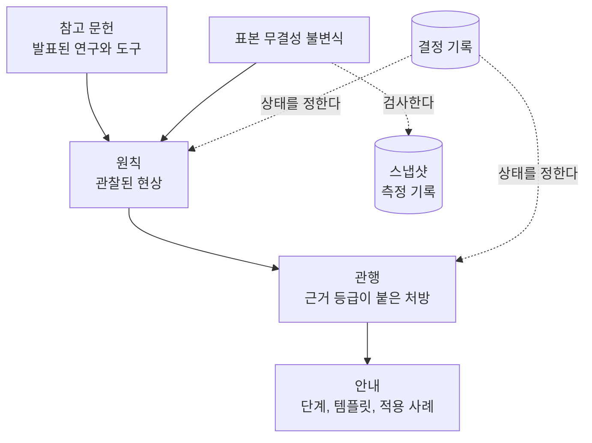
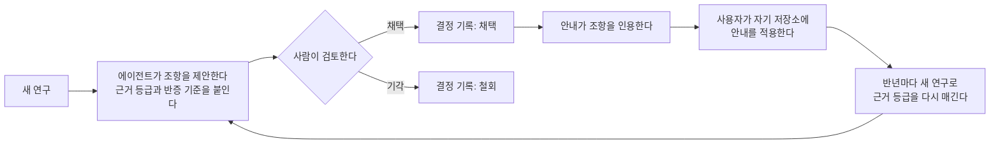

<!-- source: README.md sha256: f8783628fb86234920a7d13fc5f6c8777823c7b29c6456da924b17180197ed6d -->
# stable-agent-documentation-guidebook

이 가이드북은 코드가 바뀌어도 내용이 정확하게 유지되는 저장소 문서(README, ARCHITECTURE, 컨텍스트 파일, CONTRIBUTING)를 작성하는 방법을 안내합니다. 에이전트는 작업하기 전에 이 문서들을 읽기 때문에, 낡은 문서는 에이전트에게 틀린 사실을 전달합니다. 이미 발표된 연구와 현재 운영되는 도구를 적용하며, 새로운 도구는 만들지 않습니다. 모든 조항에는 근거 등급과 반증 기준이 붙어 있습니다. 원본은 영어로 작성하며 Simplified Technical English(STE)를 따릅니다. 번역본은 해당 언어의 작성 지침을 따릅니다([DESIGN.md](DESIGN.md) 11절).

이 문서는 영어 원본인 [README.md](README.md)를 한국어로 옮긴 번역본입니다. 한국어 번역본은 [fluent-korean](https://github.com/snflkd/fluent-korean) 지침에 따라 작성합니다. 번역본과 원본의 내용이 서로 다르면 영어 원본을 따릅니다.

## 구조

## 동작 방식

## 문서

- 새 프로젝트에 적용하는 순서: [guides/new-project.md](guides/new-project.md)
- 설계, 층 구조, 표본 무결성 불변식: [DESIGN.md](DESIGN.md)
- 용어: [GLOSSARY.md](GLOSSARY.md)
- 조항: [principles/](principles/), [practices/](practices/)
- 참고 문헌과 각 연구의 한계: [REFERENCES.md](REFERENCES.md)
- 결정 기록: [decisions/](decisions/)
- 스냅샷: [snapshots/](snapshots/)

## 라이선스

[MIT](LICENSE)
