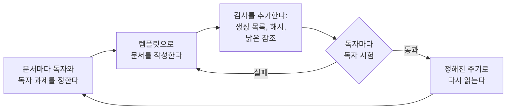
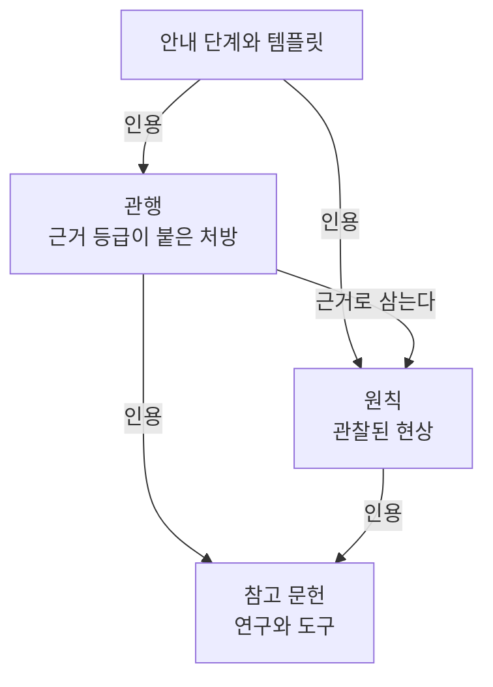

<!-- source: README.md sha256: 85b1df19db3cb17f940d4eab07441c099f4c75608e721e5589a04967549aa265 -->
# stable-agent-documentation-guidebook

에이전트는 작업하기 전에 저장소의 문서를 읽습니다. 대상은 README, ARCHITECTURE, AGENTS.md 같은 컨텍스트 파일, CONTRIBUTING입니다. 문서가 낡았거나 엉뚱한 독자를 위해 쓰였다면, 에이전트는 틀린 사실을 바탕으로 일하게 됩니다. 이 가이드북은 문서마다 독자를 정하고 그 독자를 위해 쓰는 방법을 안내합니다. 또한 코드가 바뀌어도 문서가 정확하게 유지되도록 관리하는 방법과, 그 독자로 문서를 시험하는 방법도 안내합니다. 이미 발표된 연구와 현재 운영되는 도구를 적용하며, 새로운 도구는 만들지 않습니다. 모든 조항에는 근거 등급과 반증 기준이 붙어 있습니다. 원본은 영어로 작성하며 Simplified Technical English(STE)를 따릅니다. 번역본은 해당 언어의 작성 지침을 따릅니다([DESIGN.md](DESIGN.md) 11절).

이 문서는 영어 원본인 [README.md](README.md)를 한국어로 옮긴 번역본입니다. 한국어 번역본은 [fluent-korean](https://github.com/snflkd/fluent-korean) 지침에 따라 작성합니다. 번역본과 원본의 내용이 서로 다르면 영어 원본을 따릅니다.

## 누가 무엇을 읽는가

| 독자 | 읽을 문서 | 독자 과제 |
|---|---|---|
| 저장소의 문서를 작성하는 사람이나 에이전트 | [guides/new-project.md](guides/new-project.md), [guides/templates/](guides/templates/) | 저장소의 문서와 검사를 만들고, 각 문서를 그 독자로 시험합니다 |
| 컨텍스트 파일에서 규칙을 인용하는 사람 | [principles/](principles/), [practices/](practices/) | 규칙의 내용, 근거의 강도, 규칙이 틀리게 되는 조건을 설명합니다 |
| 조항을 검증하는 사람 | [REFERENCES.md](REFERENCES.md) | 각 출처와 그 한계를 찾습니다 |
| 이 가이드북을 고치는 사람이나 에이전트 | [AGENTS.md](AGENTS.md), [DESIGN.md](DESIGN.md), [GLOSSARY.md](GLOSSARY.md), [decisions/](decisions/) | 들어오는 조건을 충족하는 조항을 추가하거나 고칩니다 |

## 사용 방법

## 각 단계를 뒷받침하는 것

조항이 제안되고 채택되고 다시 평가되는 과정은 DESIGN.md에 있습니다. 측정 기록은 [snapshots/](snapshots/)에 있습니다.

## 라이선스

[MIT](LICENSE)
