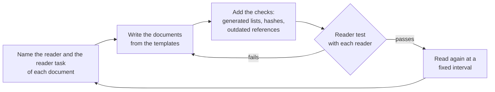
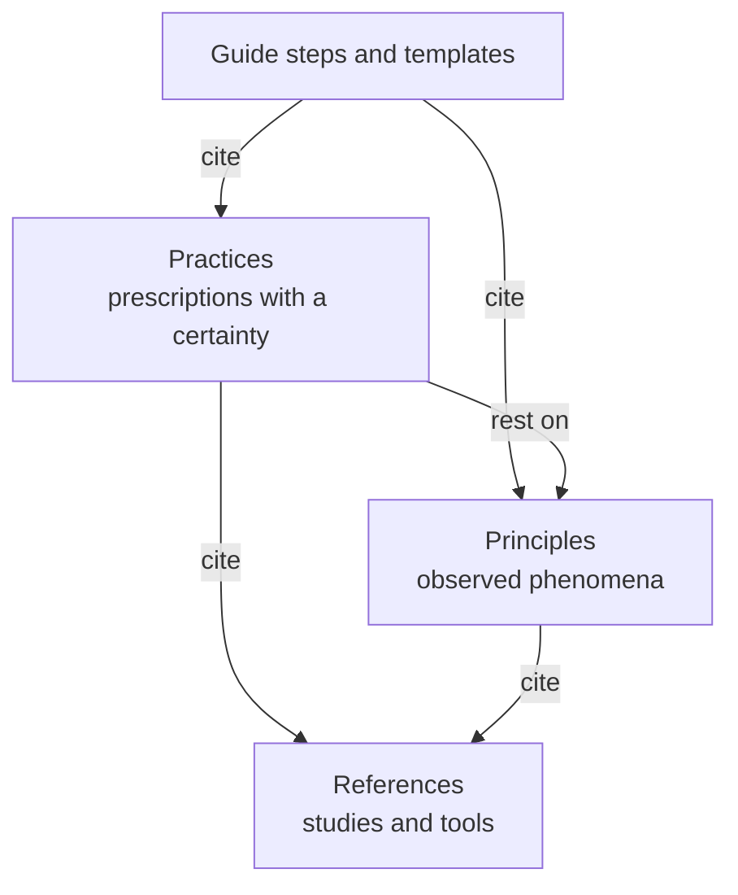

# stable-agent-documentation-guidebook

Agents read the documents of a repository before they work: README, ARCHITECTURE, context files such as AGENTS.md, and CONTRIBUTING. If a document is outdated or is written for the wrong reader, the agent works from wrong facts. This guidebook tells you how to name the reader of each document and write for that reader. It also tells you how to keep the document correct as the code changes, and how to test it with that reader. It applies published research and available tools, and it makes no new tools. Each clause has a certainty and a falsification criterion. The originals are in English and follow Simplified Technical English (STE). Translations follow the style guide of their language ([DESIGN.md](DESIGN.md) §11).

## Who reads what

| Reader | Read | Reader task |
|---|---|---|
| A person or an agent that writes the documents of a repository | [guides/new-project.md](guides/new-project.md) and [guides/templates/](guides/templates/) | Make the documents and the checks of the repository, and test each document with its reader |
| A person who cites a rule in a context file | [principles/](principles/) and [practices/](practices/) | Tell what the rule says, how strong its evidence is and when it is wrong |
| A person who verifies a clause | [REFERENCES.md](REFERENCES.md) | Find each source and its limits |
| A person or an agent that changes this guidebook | [AGENTS.md](AGENTS.md), [DESIGN.md](DESIGN.md), [GLOSSARY.md](GLOSSARY.md) and [decisions/](decisions/) | Add or change a clause that meets the entry conditions |

## How to use it

## What backs each step

DESIGN.md shows how a clause is proposed, adopted and graded again. Measurements are in [snapshots/](snapshots/). A Korean translation is in [README.ko.md](README.ko.md).

## License

[MIT](LICENSE)
