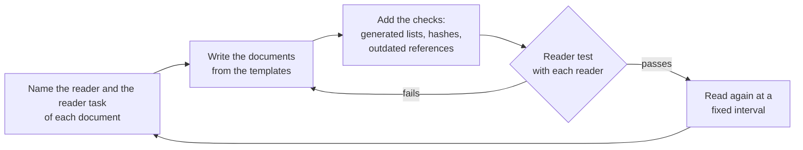
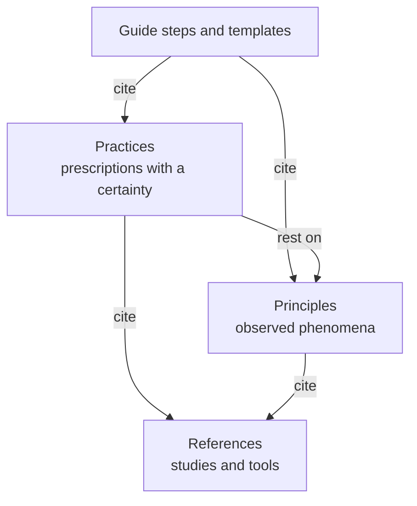

# stable-agent-documentation-guidebook

Agents read the documents of a repository before they work: README, ARCHITECTURE, context files such as AGENTS.md, and CONTRIBUTING. If a document is outdated or is written for the wrong reader, the agent works from wrong facts. This guidebook tells you how to name the reader of each document and write for that reader. It also tells you how to keep the document correct as the code changes, and how to test it with that reader. It applies published research and available tools, and it makes no new tools.

Each clause has a certainty and a falsification criterion. A clause is proposed until a decision record adopts it, so read the status of each clause before you use it. The originals are in English and follow Simplified Technical English (STE). Translations follow the style guide of their language ([DESIGN.md](DESIGN.md) §11).

## Who reads what

This table names the reader and the reader task of each document of this repository (R-004).

| Document | Reader | Reader task |
|---|---|---|
| This README | A person or an agent that sees the guidebook for the first time | Tell what the guidebook is for and find the next document |
| [guides/new-project.md](guides/new-project.md), [guides/templates/](guides/templates/) | A person or an agent that writes the documents of a repository | Make the documents and the checks, and test each document with its reader |
| [guides/case-swift-monorepo.md](guides/case-swift-monorepo.md) | The same writer | See one application of the guide |
| [principles/](principles/), [practices/](practices/) | A person who cites a clause in a context file | Tell what the clause says, how strong its evidence is and when it is wrong |
| [REFERENCES.md](REFERENCES.md) | A person who verifies a clause | Find each source and its limits |
| [GLOSSARY.md](GLOSSARY.md) | Each writer and reader of this repository | Find the meaning and the source of a term |
| [DESIGN.md](DESIGN.md), [AGENTS.md](AGENTS.md) | A person or an agent that changes this guidebook | Add or change a clause that meets the entry conditions |
| [decisions/](decisions/) | A person or an agent that wants to change a decision | Tell why the decision was made and which alternatives failed |
| [snapshots/](snapshots/) | A person who checks a measurement | Find the data and the conditions of the measurement |
| [README.ko.md](README.ko.md) | A Korean reader of this README | The same task as this README |

## How to use it

## What backs each step

DESIGN.md shows how a clause is proposed, adopted and graded again.

## License

[MIT](LICENSE)
