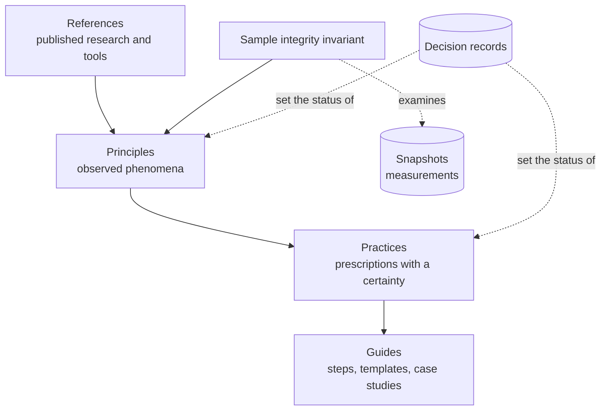
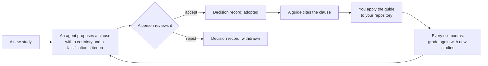

# stable-agent-documentation-guidebook

This guidebook tells you how to write repository documents (README, ARCHITECTURE, context files, CONTRIBUTING) that stay correct when the code changes. Agents read these documents before they work, so an outdated document gives them wrong facts. The guidebook applies published research and available tools, and it makes no new tools. Each clause has a certainty and a falsification criterion. The originals are in English and follow Simplified Technical English (STE). Translations follow the style guide of their language ([DESIGN.md](DESIGN.md) §11).

## Structure

## How it works

## Documents

- Start a project: [guides/new-project.md](guides/new-project.md)
- Design, layers and the sample integrity invariant: [DESIGN.md](DESIGN.md)
- Terms: [GLOSSARY.md](GLOSSARY.md)
- Clauses: [principles/](principles/), [practices/](practices/)
- References and their limits: [REFERENCES.md](REFERENCES.md)
- Decision records: [decisions/](decisions/)
- Snapshots: [snapshots/](snapshots/)
- Korean translation: [README.ko.md](README.ko.md)

## License

[MIT](LICENSE)
