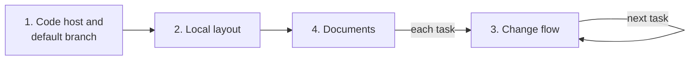

# Set up a repository

Use this procedure when you make a new repository, before the first document. It decides where agents write and how changes reach the default branch. The procedure follows the rules for guides in [DESIGN.md](../DESIGN.md) §2. [Decision 0008](../decisions/0008-repository-setup.md) gives the reason and the limits. No study measures the effect of this setup on documents. Thus only steps 10 and 11 have a clause. [Snapshot 2026-09-25](../snapshots/2026-09-25-setup-simulation/README.md) measured the setup in a simulation. It is an observation, not evidence (DESIGN.md §3).

Each step gives the steps that it needs, its basis and a completion criterion.

## Roadmap

Do phases 1, 2 and 4 one time. Do phase 3 for each task, also for each document of phase 4. When an agent reports its work on the setup, use [notes.md](notes.md).

Step 1 puts this checklist in one place. Mark each phase when the completion criteria of its steps are true.

- [ ] Phase 1, [code host and default branch](#1-code-host-and-default-branch): steps 1 to 4
- [ ] Phase 2, [local layout](#2-local-layout): step 5
- [ ] Phase 3, [change flow](#3-change-flow): steps 6 to 9, for the first task
- [ ] Phase 4, [documents](#4-documents): steps 10 and 11

## 1. Code host and default branch

1. **Keep the checklist of the roadmap in one place.** Use one tracker item or one file for each repository. Other documents link to it and do not copy it.
   Needs: nothing.
   Basis: [23].
   Done when: one place holds the checklist, and no other document of the repository contains a copy.
2. **Make the repository on the code host with one commit on the default branch.**
   Needs: step 1.
   Basis: no clause or reference.
   Done when: the default branch exists on the code host.
3. **Protect the default branch.** Make a protection rule: no one can push to the default branch. A change reaches it only through a change request. The rule also applies to administrators. Step 11 writes the change path for agents. In the [snapshot 2026-09-25](../snapshots/2026-09-25-setup-simulation/README.md), protection with no documented change path blocked a needed fix in each run.
   Needs: step 2.
   Basis: [34] [35].
   Done when: the code host rejects a direct push to the default branch, also from an administrator.
4. **Require an approval and the checks before a merge.** Add each new check to the protection rule when you add the check.
   Needs: step 3.
   Basis: [34] [35]. The checks come from steps 8 to 10 of [new-project.md](new-project.md).
   Done when: a change request with no approval cannot merge, and each check is required. Verify this with a test change request that has no approval.

## 2. Local layout

5. **Clone the repository as a bare repository.** A bare repository has no worktree of its own. Thus no worktree is on the default branch. Run `git clone --bare <url> <name>.git`. A bare clone has no remote-tracking branches, so set them: `git config remote.origin.fetch "+refs/heads/*:refs/remotes/origin/*"`. Then run `git fetch origin`. In the [snapshot 2026-09-25](../snapshots/2026-09-25-setup-simulation/README.md), the bare layout showed no effect over a normal clone with the protection rule. It stays because it keeps no worktree on the default branch.
   Needs: step 2.
   Basis: [33]. [Note 2026-09-25](../notes/2026-09-25-bare-worktree-trial.md) records one trial.
   Done when: `git worktree list` shows only the bare repository, with the mark `(bare)`.

## 3. Change flow

6. **Start the task in a new worktree from the fetched default branch.** Run `git fetch origin`. Then run `git worktree add -b <branch> <path> origin/<default branch>`. To read the default branch, use `git show origin/<default branch>:<file>`. Put the worktree in a directory next to the bare repository, for example `../<task>`. Do not put it inside the directory of the bare repository, because Git keeps its own data there.
   Needs: step 5.
   Basis: [33]. [Note 2026-09-25](../notes/2026-09-25-bare-worktree-trial.md) records one trial.
   Done when: `git worktree list` shows the new worktree on its branch, and no worktree on the default branch. No worktree is inside the directory of the bare repository.
7. **Send the branch as a change request.** Before the merge, update the branch in its worktree. Run `git fetch origin`, then merge or rebase `origin/<default branch>`. Resolve each conflict in the worktree, and run the checks again.
   Needs: steps 3 and 6.
   Basis: [34] [35]. No clause or reference for the update. In the [snapshot 2026-09-25](../snapshots/2026-09-25-setup-simulation/README.md), overlapping tasks merged only with this update.
   Done when: the change request exists, and the required checks ran on it. The branch contains the fetched default branch, and the checks passed after the update.
8. **Merge the change request after the checks pass and a reviewer approves.** Merge change requests one at a time. If a merge has a conflict or a check fails, do the update of step 7 again. Then send the branch again.
   Needs: steps 4 and 7.
   Basis: [34] [35]. No clause or reference for the order and the retry.
   Done when: the default branch contains the change, and the change request records the approval.
9. **Remove the worktree.** Run `git worktree remove <path>` right after the merge, in the same task.
   Needs: step 8.
   Basis: [33]. [Note 2026-09-25](../notes/2026-09-25-bare-worktree-trial.md) records one trial.
   Done when: `git worktree list` shows no worktree for a merged branch.

## 4. Documents

10. **Write the documents with [new-project.md](new-project.md), one task at a time.** In its step 5, add one rule to the context file. The rule: start each task in a new worktree from the fetched default branch. Give the rule a reason. Nothing on the code host makes an agent start in a new worktree. Do not write the protection rule in the context file, because the code host enforces it.
    Needs: steps 4 and 5.
    Basis: R-001, R-002.
    Done when: the context file has the rule for worktrees with a reason. It does not state the protection rule.
11. **Write the change path for agents.** In the context file or in CONTRIBUTING, give the command or the flow that sends a change request. Tell how it merges into the default branch.
    Needs: steps 3 and 7.
    Basis: R-002. In the [snapshot 2026-09-25](../snapshots/2026-09-25-setup-simulation/README.md), protection with no documented change path blocked a needed fix in each run. With the change path, each fix went through a change request.
    Done when: the document gives the command or the flow. In a reader test, an agent must ship a fix at once. It sends a change request and pushes nothing to the default branch.
