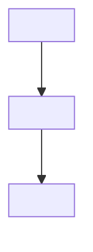

<!-- Skeleton: replace the text in angle brackets, then delete this comment. Write only information that changes rarely. Do not write lists, versions, options or numbers. -->
# Architecture

<The purpose of this repository in one paragraph: who uses it and what it contains.>

## Folder layout

```
<repository>/
├── <folder>/   <role in one line>
└── <folder>/   <role in one line>
```

<The conventions in the folders, for example "one folder contains one app". Do not list items that change frequently. Give the command that lists them.>

## Dependency direction



<The reverse direction is not permitted. Name the files that contain the real dependencies.>

## Main flows

<The sequence of work when you add a feature. The command for each step.>

## Boundaries

<The rules that keep the structure. Tell which part must not use which part, and which tool must not contain which feature.>

## Rules for change

Agents and people who change this document or the README follow `guides/new-project.md` §3 of https://github.com/dalsoop/stable-agent-documentation-guidebook at <commit or tag>. This section keeps only what belongs to this repository.

### Readers

| Document | Reader | Reader task | Last reader test |
|---|---|---|---|
| <document> | <who reads it> | <what the reader can do after reading> | <date and result> |

### Exceptions

<Rules of the guide that this repository does not follow, each with a reason. Delete this section if there are none.>

### Review

Read all documents again every <interval>. Last review: <date>.

### Check status

- `<check command>` verifies: <required headings, links, generated blocks>
- A person must verify: <rules with no check>

## References

<The sources of the rules in this document, for example the guidebook at a commit.>
