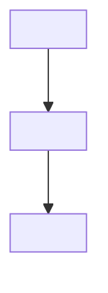

<!-- Skeleton: replace the text in angle brackets, then delete this comment. Write only information that changes rarely. Do not write lists, versions, options or numbers. -->
# Architecture

<The purpose of this repository in one paragraph: who uses it and what it contains.>

## Folder layout

```
<repository>/
├── <folder>/   <role in one line>
└── <folder>/   <role in one line>
```

<The conventions in the folders, for example "one folder contains one app". Do not list items that change frequently. Give the command that lists them.>

## Dependency direction



<The reverse direction is not permitted. Name the files that contain the real dependencies.>

## Main flows

<The sequence of work when you add a feature. The command for each step.>

## Boundaries

<The rules that keep the structure. Tell which part must not use which part, and which tool must not contain which feature.>

## Rules for change

These rules are for agents and people who change this document or the README. Source: `guides/new-project.md` §3 and reference [22] in https://github.com/dalsoop/stable-agent-documentation-guidebook. Copy the rules again when the guidebook changes.

### Readers

| Document | Reader | Reader task | Last reader test |
|---|---|---|---|
| <document> | <who reads it> | <what the reader can do after reading> | <date and result> |

### Rules

1. **Write only information that changes rarely.** Write only the five sections above. Put behavior in the help of the tool.
2. **Do not add sentences when a feature changes.** Put behavior in the help and reasons in a decision record in `decisions/`.
3. **Give code elements names that a reader can search for.** Add a link only if a check verifies the target.
4. **Do not put lists from code in this document.** Give the command that shows them. If a different document needs a list, generate it. Make the check fail when the two are different.
5. **Read this document again every <interval>.** Delete outdated sentences and sentences that do not change what a reader does. Last review: <date>.

### Check status

- `<check command>` verifies: <required headings, links, generated blocks>
- A person must verify: <rules with no check>

## References

<The sources of these rules, for example the guidebook and the references it cites.>
