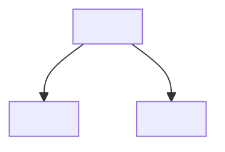

<!-- Skeleton: replace the text in angle brackets, then delete this comment. The two diagrams are optional. Put details of the structure and rules for work in other documents. -->
# <repository>

<What it is and why it exists, in one paragraph.> [ARCHITECTURE.md](ARCHITECTURE.md) gives the details of the structure. [AGENTS.md](AGENTS.md) gives the rules for agents.

## Structure



## How it works


## First commands

```bash
<first command to run>
<check command>
<tool> help          # all commands and their details
```

<If a first run often fails, tell where in one paragraph.>
